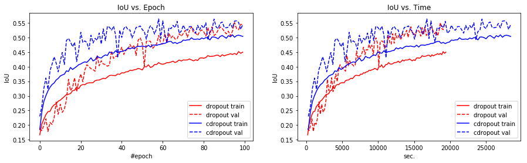
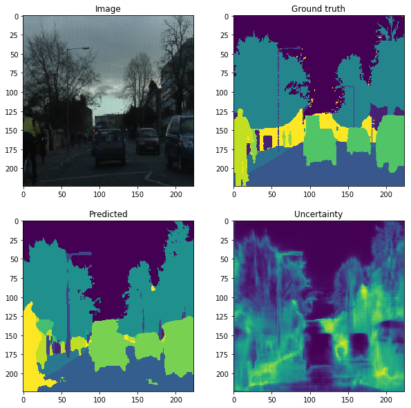
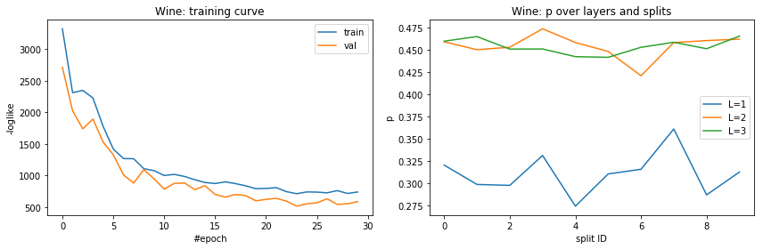
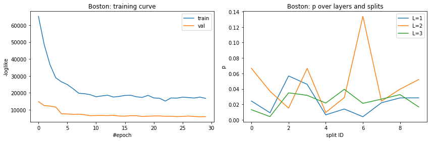
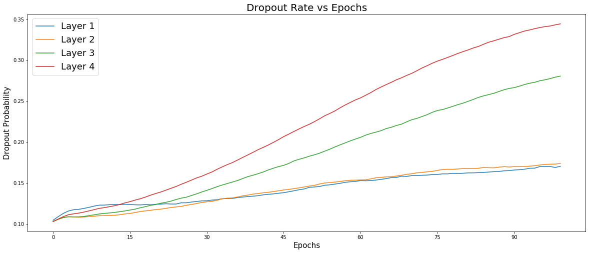
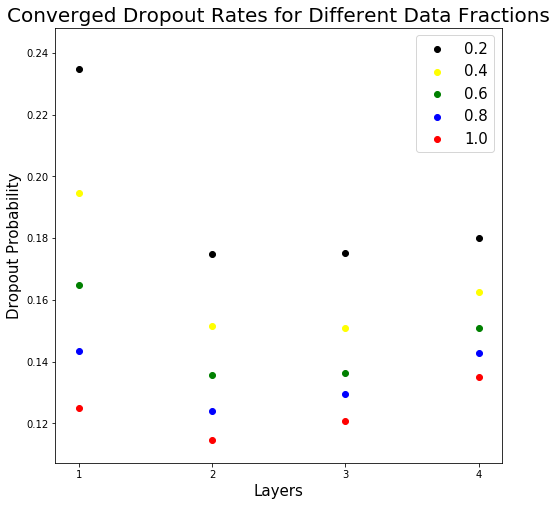

# ConcreteDropout
Bayesian Methods for Machine Learing Course Project Skoltech 2018 

## Table of content
- [Description](#description)
- [Authors](#authors)
- [Results](#results)
- [Usage](#usage)
- [References](#references)
- [License](#license)

## Description 

We replicate the results of the recent paper *Concrete Droput* by Gal et al. and extend the results to new experiments.

### Basic:
- Understand and discuss model implementation
- Reproduce experiments on: MNIST, Computer vision task and Reinforcement Learning


### Extensions:
- Try different RL environments 
- Evaluate the algorithm performance for NLP tasks
- Implement the Concrete Droupout for Recurrent Layers

## Authors

 - [Valerii Likhosherstov](https://github.com/ValeryTyumen)
 - [Alfredo de la Fuente](https://alfo5123.github.io/)

## Results

### Computer Vision - Segmentation Task 
---

 



### UCI - Regression Task
---

**Wine dataset**
 

**Boston dataset**


### MNIST - Classification Task
---



<div align="center">
 
</div>

## Usage
```
git clone https://github.com/Alfo5123/ConcreteDropout.git
```

## References

Papers:
- **[Concrete Dropout](https://arxiv.org/pdf/1705.07832.pdf)**
- [Dropout as a Bayesian Approximation: Representing Model Uncertainty in Deep Learning](https://arxiv.org/pdf/1506.02142.pdf)
- [Categorical Reparameterization with Gumbel-Softmax](https://arxiv.org/pdf/1611.01144.pdf)
- [Variational Dropout and the Local Reparameterization Trick](https://arxiv.org/pdf/1506.02557.pdf)
- [The Concrete Distribution: A Continuous Relaxation of Discrete Random Variables](https://arxiv.org/pdf/1611.00712.pdf)
- [Improving  PILCO  with  Bayesian  Neural  Network  Dynamics  Models](http://mlg.eng.cam.ac.uk/yarin/PDFs/DeepPILCO.pdf)
- [Recurrent Neural Network Regularization](https://arxiv.org/pdf/1409.2329.pdf)

Repositories:
- **[Main Author Implementation](https://github.com/yaringal/ConcreteDropout)**
- [Variational Dropout](https://github.com/j-min/Dropouts)
- [Probabilistic Inference for Learning Control](https://github.com/nrontsis/PILCO)

Blogs: 
- [The Gumbel-Softmax Trick for Inference of Discrete Variables](https://casmls.github.io/general/2017/02/01/GumbelSoftmax.html)
- [Reparametrization Trick](https://gabrielhuang.gitbooks.io/machine-learning/content/reparametrization-trick.html)
- [A review of Dropout as applied to RNNs](https://medium.com/@bingobee01/a-review-of-dropout-as-applied-to-rnns-72e79ecd5b7b)
- [ Dropout in Recurrent Networks — Part 1](https://becominghuman.ai/learning-note-dropout-in-recurrent-networks-part-1-57a9c19a2307)

## License
[MIT License](https://github.com/Alfo5123/ConcreteDropout/blob/master/LICENSE)

